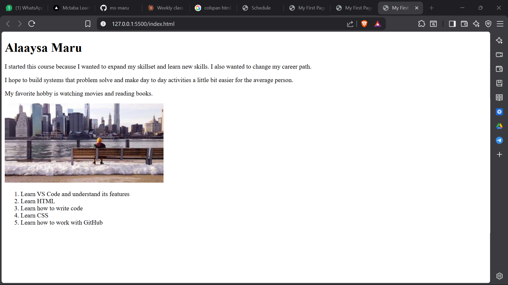
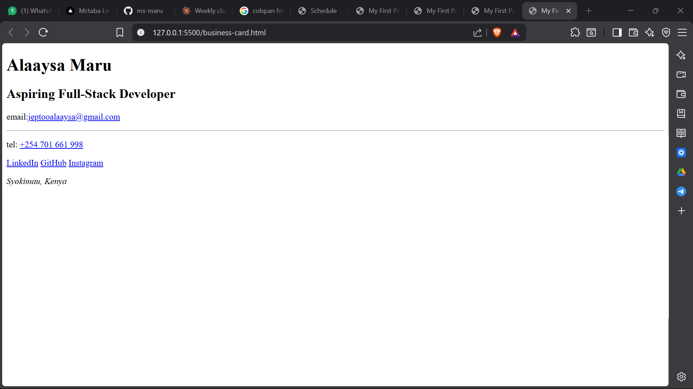
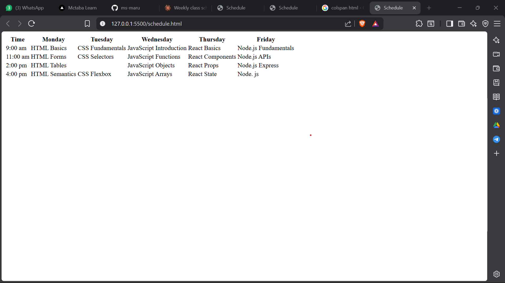

# WEEK-1-DAY-1-ASSIGNMENTS

## Overview
First mctaba assignment starting HTML from scratch focusing on what programming is, setting up my development environment, and write my  first HTML. This assignment reinforces HTML document structure, semantic elements, and building real content.

## Features
- index.html screenshot
- business-card.html screen shot
- schedule.html screen shot

## Screenshots

### index.html screenshot

*This is a screenshot of the index.html page*

### business-card.html screen shot

*This is a screenshot of the business-card.html page*

### schedule.html screen shot

*This is a screenshot of the schedule.html page*
